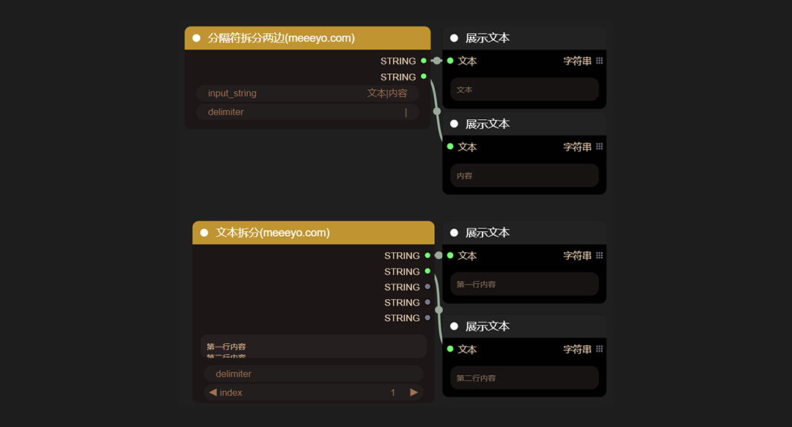

# ComfyUI_StringOps
**Efficient Text Processing Tool for ComfyUI Workflow**

ComfyUI_StringOps is an advanced text processing tool tailored for the ComfyUI workflow, offering robust text manipulation capabilities to address core issues such as text preprocessing, data transformation, and batch automation, enabling efficient and precise operations.

 - **Batch Replacement：**
Supports partial or global batch replacement of strings for rapid text processing and delivery to subsequent processes, enhancing task efficiency.

 - **Intelligent Splitting/Concatenation：**
Splits text based on character counts and delimiters, and supports flexible recombination of multiple text segments to meet complex processing needs.

 - **Precise Extraction：**
Accurately extracts specified content from text using positional indexing and keyword matching, providing precise data support for subsequent processes.

 - **Integration with Excel：**
Achieves deep integration with Excel, supporting read and write operations on paged and tabular data, facilitating batch completion of complex tasks and significantly improving efficiency.


## Partial Node Display
**Text Processing Node**
   
   
   
   
   

**Table Data Read/Write Nodes**
   

ComfyUI_StringOps excels in handling prompts within workflows, especially in organizing and optimizing them, thereby significantly enhancing efficiency and accuracy.

## Install
```cd ComfyUI/custom_nodes```
```git clone https://github.com/MeeeyoAI/ComfyUI_StringOps.git```

Or download the zip file and extracted, copy the resulting folder to ```ComfyUI\custom_ Nodes Restart ComfyUI```

## About me
✅ `bilibili:` https://space.bilibili.com/3546690300676691

✅ `Website:` http://www.meeeyo.com

✅ `Sponsorship:` https://t.zsxq.com/ufSS2

✅ `WeChat`: meeeyo